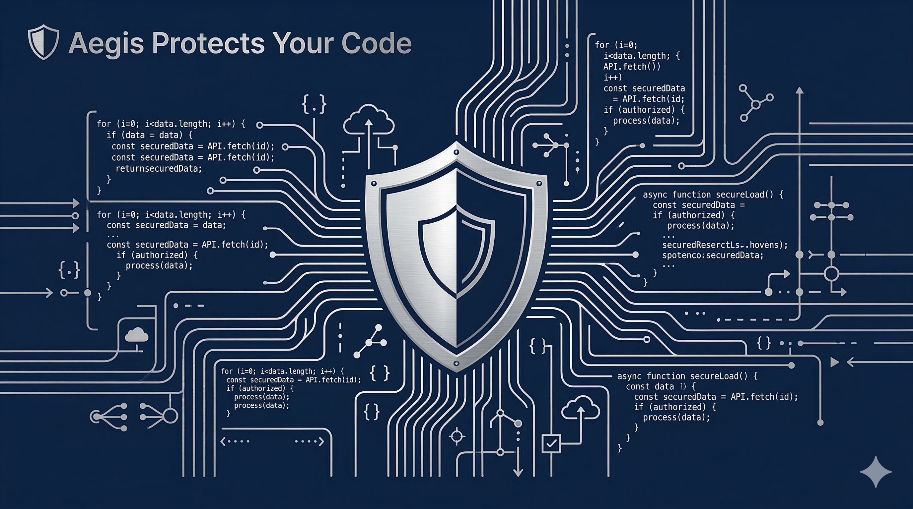
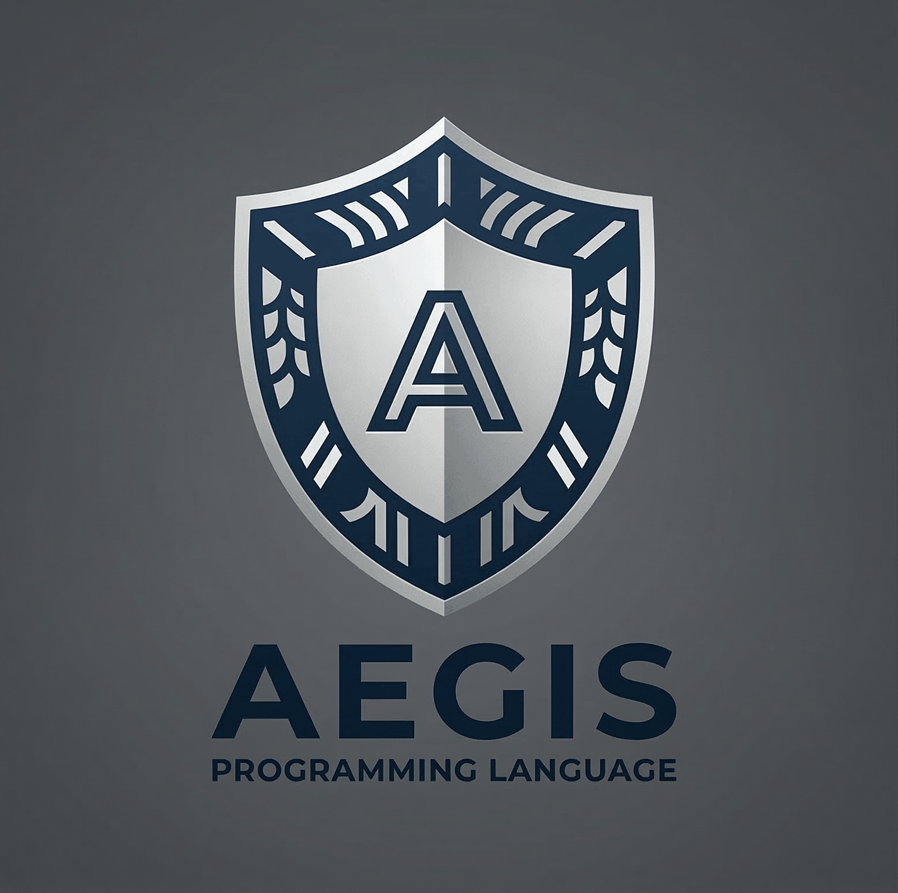

<div align="center">
  
  
  # Aegis Programming Language
  
  **A secure systems language with built-in cybersecurity features and static taint analysis**
  
  [](LICENSE)
  [](https://github.com/thtcsec/aegis/actions)
  [](https://github.com/thtcsec/aegis)
  
  [Documentation](docs/) • [Examples](examples/) • [Contributing](CONTRIBUTING.md) • [Roadmap](docs/ROADMAP.md)
</div>

---

## About

Aegis is not a general-purpose language. It's designed as a **secure systems language + cybersecurity DSL** focused on preventing vulnerabilities at compile-time through advanced static analysis.

Developed by **Trinh Hoang Tu (thtcsec)** and the **Aegis Foundation**.

## Why Aegis?



Traditional languages leave security as an afterthought. Aegis makes security a core language feature:

- **Static Taint Analysis** - Track untrusted data through your entire program
- **SQL Injection Prevention** - Enforce parameterized queries at compile-time
- **Memory Safety** - Automatic bounds checking and lifetime analysis
- **Command Injection Detection** - Prevent shell injection vulnerabilities
- **Capability-Based Security** - Explicit permission declarations
- **Exploit Automation** - Built-in tools for security research

## Example

```aegis
input user_data
query = sql("SELECT * FROM users WHERE id = ?", user_data)
execute query
```

Compiler warning: `tainted input detected in SQL query`

## Architecture

```
Aegis source
    ↓ Lexer
    ↓ Parser
    ↓ AST
    ↓ Semantic analysis
    ↓ Security analysis
    ↓ LLVM IR
    ↓ LLVM optimizer
    ↓ Machine code
```

## Project Structure

```
aegis-foundation/
├─ compiler/       # Compiler implementation
├─ runtime/        # Runtime system
├─ std/           # Standard library
├─ cli/           # CLI tools
├─ tests/         # Test suite
└─ docs/          # Documentation
```

## Features

- Static taint analysis for tracking untrusted data
- SQL injection detection with parameterized query enforcement
- Command injection prevention
- Path traversal detection
- Memory safety guarantees
- LLVM-based native code generation

## Documentation

- [Syntax Specification](docs/SYNTAX.md) - Complete language syntax
- [Type System](docs/TYPE_SYSTEM.md) - Type system design
- [Grammar](docs/GRAMMAR.md) - Formal grammar definition
- [Scope](docs/SCOPE.md) - Project scope and boundaries
- [Getting Started](docs/GETTING_STARTED.md) - English guide
- [Bắt Đầu](docs/BAT_DAU.md) - Vietnamese guide
- [Architecture](docs/ARCHITECTURE.md) - Compiler design
- [Security Features](docs/SECURITY_FEATURES.md) - Security analysis details
- [Roadmap](docs/ROADMAP.md) - Development plan (private)


## Quick Start

### Installation

```bash
git clone https://github.com/thtcsec/aegis.git
cd aegis
mkdir build && cd build
cmake ..
cmake --build .
```

### Your First Program

```aegis
fn main() {
    print("Hello, Aegis!")
}
```

Run it:
```bash
aegis run hello.aeg
```

### Security Example

```aegis
import std.db
import std.crypto

fn authenticate(username: string, password: string) -> bool {
    let hash = crypto.sha256(password)
    let query = sql(
        "SELECT * FROM users WHERE username = ? AND password_hash = ?",
        username,
        hash
    )
    let result = db.execute(query)
    return result.count() > 0
}

fn main() {
    let username = input()
    let password = input()
    
    if authenticate(username, password) {
        print("Login successful!")
    } else {
        print("Login failed!")
    }
}
```

### Cybersecurity DSL

```aegis
// Port scanning
scan "192.168.1.1" port 80
scan "192.168.1.1" ports 1..1024

// Network sniffing
sniff "eth0" filter "tcp port 80"
```

### CLI Commands

```bash
aegis build main.aeg    # Compile
aegis run main.aeg      # Run
aegis check main.aeg    # Security analysis
aegis scan target       # Vulnerability scan
```

## File Extension

`.aeg`

## Community & Support

- **GitHub**: [github.com/thtcsec/aegis](https://github.com/thtcsec/aegis)
- **Issues**: [Report bugs or request features](https://github.com/thtcsec/aegis/issues)
- **Discussions**: [Join the conversation](https://github.com/thtcsec/aegis/discussions)
- **Contributing**: See [CONTRIBUTING.md](CONTRIBUTING.md)

## Authors

- **Trinh Hoang Tu** ([@thtcsec](https://github.com/thtcsec)) - Creator & Lead Developer
- **Aegis Foundation** - Project maintainers

## License

Licensed under the Apache License, Version 2.0. See [LICENSE](LICENSE) for details.

---

<div align="center">
  <sub>Built for the security community</sub>
</div>
